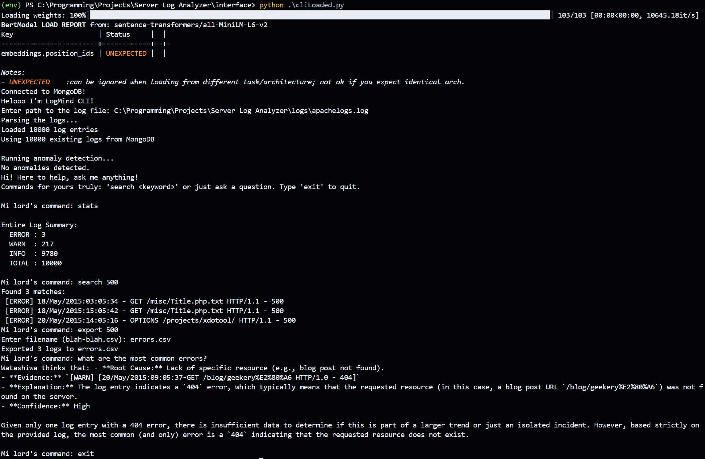
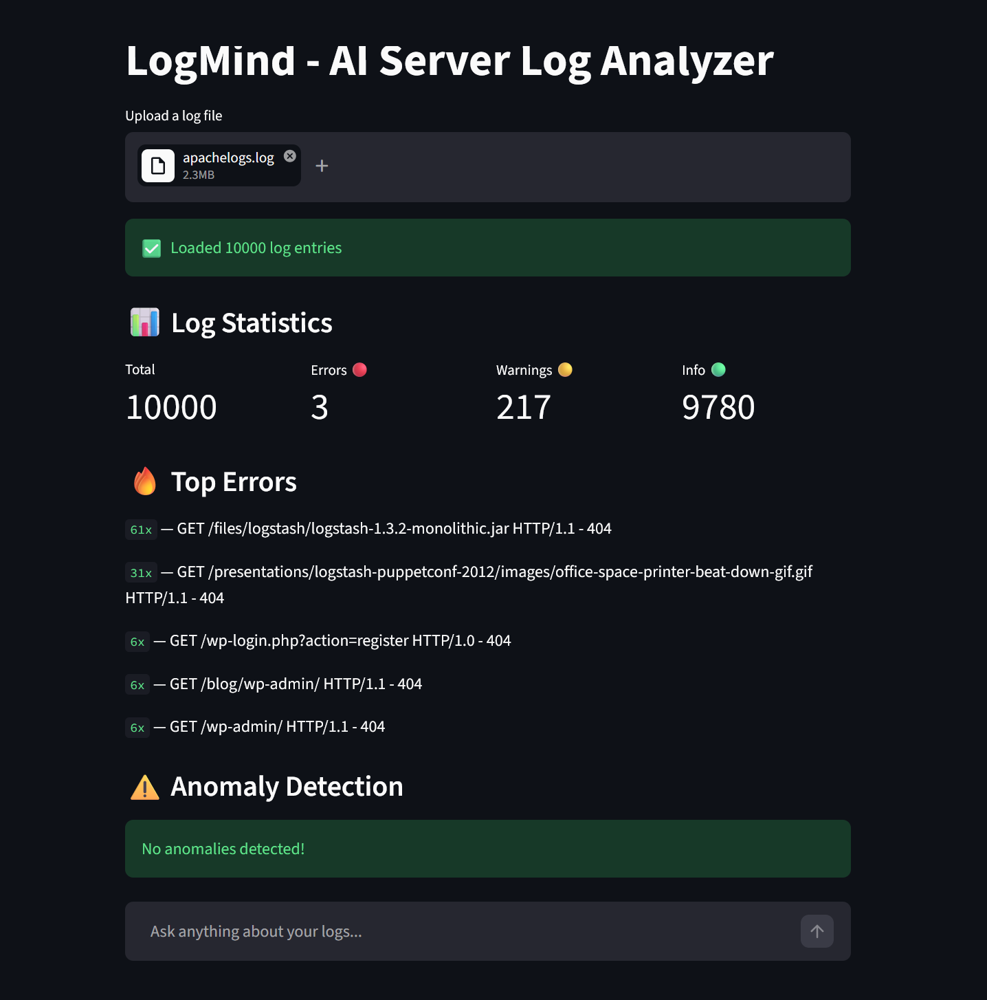
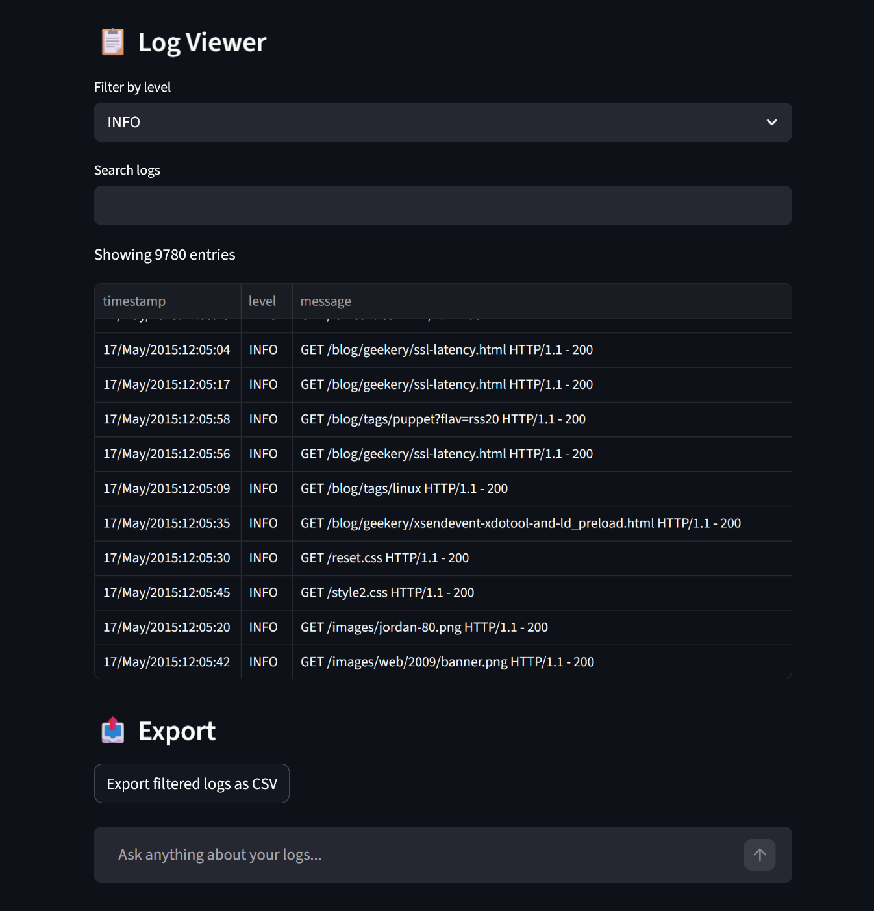
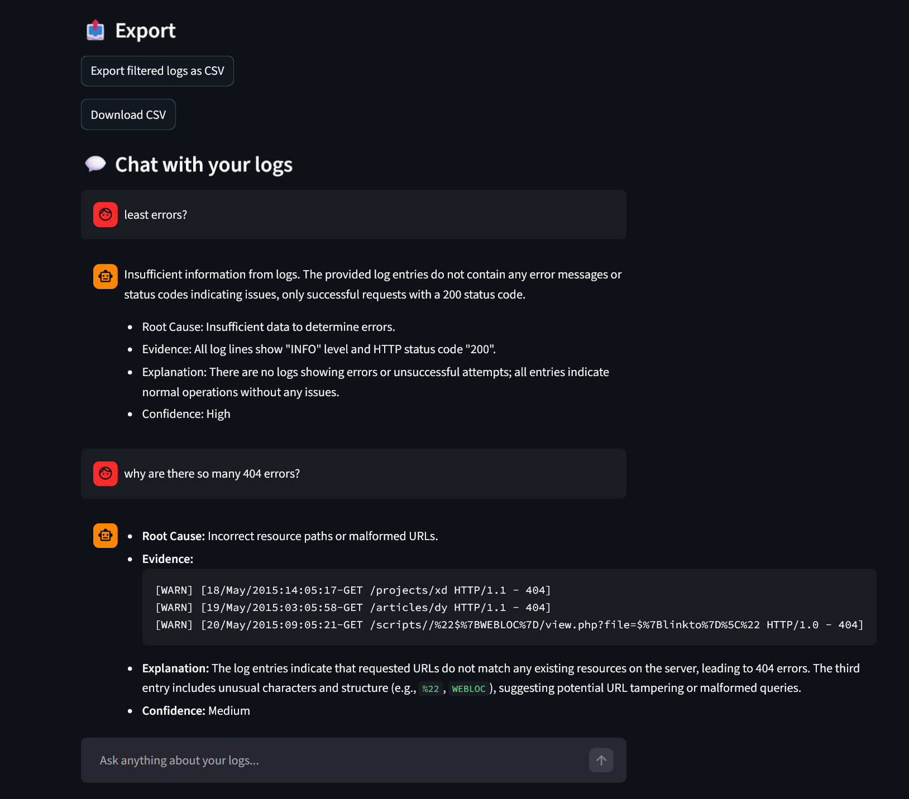

# LogMind - AI Server Log Analyzer

## What is this?



LogMind lets you chat with your server logs — load any log file and ask questions in plain English. It can summarize your logs, find the most common errors, search by keyword or error type, detect anomalies, and export filtered results to CSV.





---

## Tech Stack
| Layer | Technology |
|---|---|
| Log Parsing | Python + Regex |
| Embeddings | sentence-transformers (`all-MiniLM-L6-v2`) |
| Vector Storage | MongoDB Atlas (Vector Search) |
| LLM | Ollama — any local model (tested with DeepSeek R1:14b, Qwen2.5:14b) |
| LLM Interface | litellm (model-agnostic) |
| Interface | CLI + Streamlit |

---

## Project Structure
```
Server Log Analyzer/
├── db/
│   └── mongo_store.py         # MongoDB connection + log storage
├── embeddings/
│   └── embedder.py            # Sentence embedding using sentence-transformers
├── interface/
│   └── cli.py                 # Main CLI interface
├── llm/
│   └── llm_client.py          # LLM call via litellm
├── rag/
│   └── retriever.py           # Vector search + retrieval
├── search/
│   ├── anomaly.py             # Anomaly detection (keyword + sliding window)
│   └── keyword_search.py      # Keyword filtering
├── logs/
│   ├── sample.log             # Sample standard log file
│   └── apachelogs.log         # Sample Apache log file
├── .env                       # MongoDB URI (never commit this)
├── .gitignore
├── requirements.txt
└── README.md
```

---

## How to Run

### Prerequisites
- Python 3.9+
- [Ollama](https://ollama.com) installed and running locally
- [MongoDB Atlas](https://mongodb.com/atlas) free account

### Setup

**1. Clone the repo**
```bash
git clone https://github.com/Aryan-Kochhar/LogMind---Server-Log-Analyzer.git
cd LogMind---Server-Log-Analyzer
```

**2. Create and activate a virtual environment**
```bash
python -m venv env
env\Scripts\activate        # Windows
source env/bin/activate     # Mac/Linux
```

**3. Install dependencies**
```bash
pip install -r requirements.txt
```

**4. Set up `.env` file**
```
MONGODB_URI=mongodb+srv://<username>:<password>@cluster0.xxxxx.mongodb.net/?appName=Cluster0
```

**5. Set up MongoDB Atlas**
- Create a free M0 cluster
- Create database `log_analyzer`, collection `logs`
- Create a Vector Search index named `vector_index`:
```json
{
  "fields": [
    {
      "type": "vector",
      "path": "embedding",
      "numDimensions": 384,
      "similarity": "cosine"
    }
  ]
}
```

**6. Pull and run your Ollama model**
```bash
ollama pull qwen2.5:14b
ollama serve
```

**7. Run the CLI**
```bash
cd interface
python cli.py
```

---

## Features
- **Log Parsing** — supports standard log format and Apache access logs
- **Anomaly Detection** — auto-flags error spikes and critical keywords (timeout, deadlock, OOM)
- **RAG Chat** — ask questions in plain English, powered by local LLM + vector search
- **Keyword & Level Search** — search by keyword or filter by ERROR / WARN / INFO
- **Smart Export** — export all logs or filtered results to CSV
- **Stats & Counts** — instant breakdown of log levels and keyword counts

---

## Commands

| Command | Description |
|---|---|
| `stats` | Show ERROR / WARN / INFO breakdown |
| `count <keyword>` | Count logs containing keyword |
| `search <keyword>` | Show logs matching keyword or level |
| `top errors` | Top 5 most repeated errors |
| `summary <date>` | AI summary of a specific date |
| `export` | Export all logs to CSV |
| `export <keyword>` | Export filtered logs to CSV |
| Any question | AI chat via RAG |

---

## Example Queries
```
stats
count 404
search warn
top errors
summary 17/May/2015
what are the most common errors?
are there any security threats?
what happened on 17/May/2015?
export 404
```

---

## Supported Log Formats
- **Standard** — `2024-01-15 08:02:01 [ERROR] Database connection failed`
- **Apache** — `83.149.9.216 - - [17/May/2015:10:05:03 +0000] "GET /index.html HTTP/1.1" 200 7697`