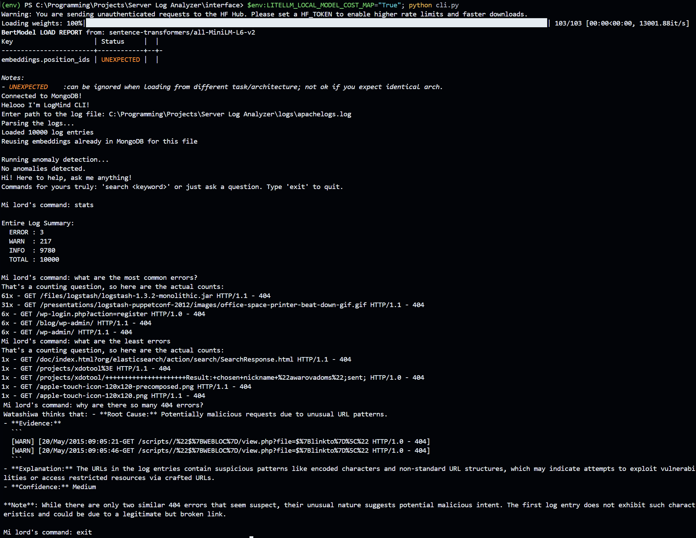
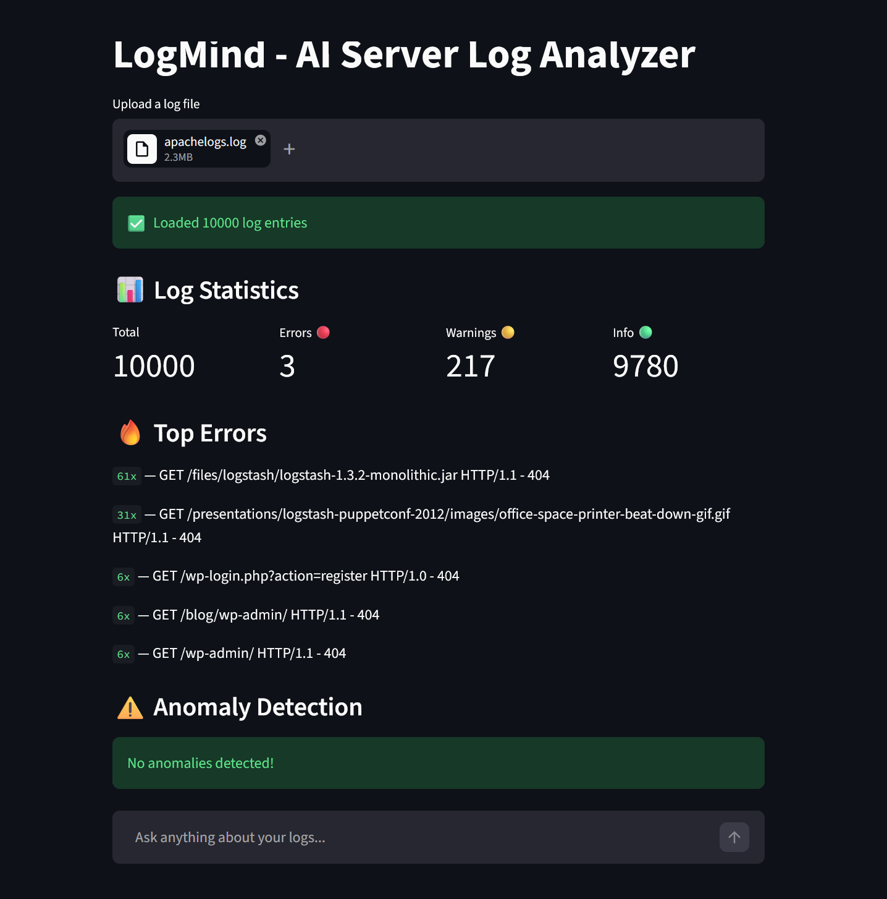
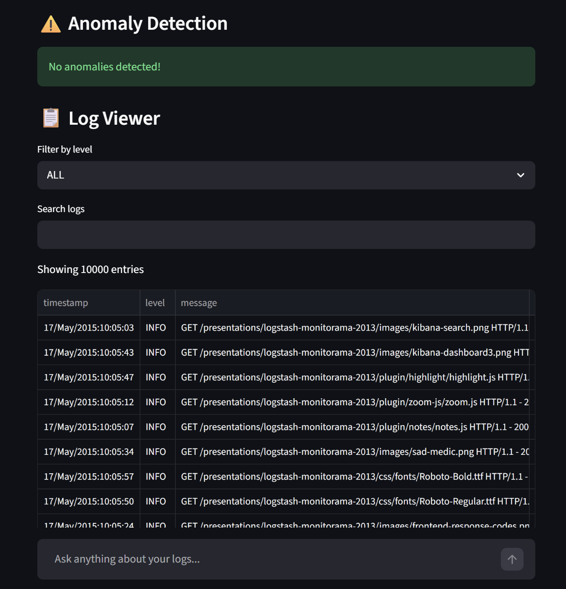
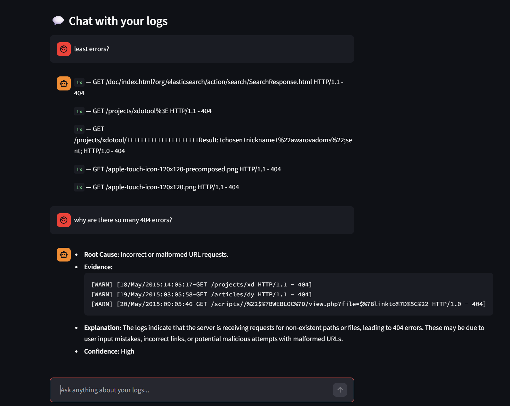

# LogMind - AI Server Log Analyzer

## What is this?


LogMind lets you chat with your server logs — load any log file and ask questions in plain English. It can summarize your logs, find the most common errors, search by keyword or error type, detect anomalies, and export filtered results to CSV.

A 2.27 MB access log is roughly 1M tokens — far past any model's context window. LogMind embeds each entry into MongoDB Atlas vector search and retrieves only the handful that matter, bringing a question down to **~108 tokens of context (a 99.97% reduction)**. See [Performance](#performance).








---

## Tech Stack
| Layer | Technology |
|---|---|
| Log Parsing | Python + Regex |
| Embeddings | sentence-transformers (`all-MiniLM-L6-v2`) |
| Vector Storage | MongoDB Atlas (Vector Search) |
| LLM | Ollama — any local model (tested with DeepSeek R1:14b, Qwen2.5:14b) |
| LLM Interface | litellm (model-agnostic) |
| Interface | CLI + Streamlit |

---

## Project Structure
```
Server Log Analyzer/
├── db/
│   └── mongo_store.py         # MongoDB connection + log storage
├── embeddings/
│   └── embedder.py            # Sentence embedding using sentence-transformers
├── interface/
│   ├── cli.py                 # Main CLI interface
│   └── app.py                 # Streamlit dashboard
├── llm/
│   └── llm_client.py          # LLM call via litellm
├── rag/
│   └── retriever.py           # Vector search + retrieval
├── search/
│   ├── anomaly.py             # Anomaly detection (keyword + sliding window)
│   └── keyword_search.py      # Keyword filtering + top-error counting
├── logs/
│   ├── sample.log             # Sample standard log file
│   └── apachelogs.log         # Sample Apache log file
├── .env                       # MongoDB URI (never commit this)
├── .gitignore
├── requirements.txt
└── README.md
```

---

## How to Run

### Prerequisites
- Python 3.9+
- [Ollama](https://ollama.com) installed and running locally
- [MongoDB Atlas](https://mongodb.com/atlas) free account

### Setup

**1. Clone the repo**
```bash
git clone https://github.com/Aryan-Kochhar/LogMind---Server-Log-Analyzer.git
cd LogMind---Server-Log-Analyzer
```

**2. Create and activate a virtual environment**
```bash
python -m venv env
env\Scripts\activate        # Windows
source env/bin/activate     # Mac/Linux
```

**3. Install dependencies**
```bash
pip install -r requirements.txt
```

**4. Set up `.env` file**
```
MONGODB_URI=mongodb+srv://<username>:<password>@cluster0.xxxxx.mongodb.net/?appName=Cluster0
```

**5. Set up MongoDB Atlas**
- Create a free M0 cluster
- Create database `log_analyzer`, collection `logs`
- Create a Vector Search index named `vector_index`:
```json
{
  "fields": [
    {
      "type": "vector",
      "path": "embedding",
      "numDimensions": 384,
      "similarity": "cosine"
    }
  ]
}
```

> **The vector index does not survive pausing and resuming an Atlas cluster.** Your documents come back but the index does not, and `$vectorSearch` returns an empty result rather than an error — so chat looks like it works while answering everything with "Insufficient information from logs." LogMind checks for this and tells you when the index is missing or still building. If you hit it, recreate the index above and wait for it to reach READY (~1 minute).

**6. Pull and run your Ollama model**
```bash
ollama pull qwen2.5:14b
ollama serve
```

**7. Run the CLI**
```bash
cd interface
python cli.py
```

**8. Run the Streamlit UI**
```
cd interface
streamlit run app.py
```

---

## Features
- **Log Parsing** — supports standard log format and Apache access logs
- **Anomaly Detection** — auto-flags error spikes and critical keywords (timeout, deadlock, OOM)
- **RAG Chat** — ask questions in plain English, powered by local LLM + vector search
- **Counting Questions** — "what are the most common errors?" is answered from real counts, not vector similarity, which ranks by meaning and would happily return a blog post with "error" in the title
- **Keyword & Level Search** — search by keyword or filter by ERROR / WARN / INFO
- **Smart Export** — export all logs or filtered results to CSV
- **Stats & Counts** — instant breakdown of log levels and keyword counts

---

## Performance

Measured on the included `logs/apachelogs.log` (10,000 lines / 2.27 MB) against a free-tier MongoDB Atlas M0 cluster. Numbers vary with hardware and network.

| Stage | Result |
|---|---|
| Parsing | 10,000 lines in **23 ms** (~440K lines/sec), 100% parse coverage |
| Ingestion | **81s** end to end for 10,000 logs (~124 docs/sec) — batched embeddings, one bulk write |
| Anomaly detection | **7.9 ms** across 10,000 entries |
| Vector search | **~259 ms** median per query (~179 ms best), including query embedding and round trip |
| Context per query | 368,852 tokens → **~108 tokens** (99.97% reduction) |

Both hot paths were profiled and rewritten. Batching embeddings and replacing per-document inserts with a single bulk write made ingestion **2.6× faster** head to head, and fixing a quadratic scan in the sliding-window detector took anomaly detection from **2.31s to 7.9 ms** on the same 10,000 entries.

---

## Commands

| Command | Description |
|---|---|
| `stats` | Show ERROR / WARN / INFO breakdown |
| `count <keyword>` | Count logs containing keyword |
| `search <keyword>` | Show logs matching keyword or level |
| `top errors` | Top 5 most repeated errors (also used for counting questions asked in plain English) |
| `summary <date>` | AI summary of a specific date |
| `export` | Export all logs to CSV |
| `export <keyword>` | Export filtered logs to CSV |
| Any question | AI chat via RAG — counting questions are answered from counts instead |

---

## Example Queries
```
stats
count 404
search warn
top errors
summary 17/May/2015
what are the most common errors?
are there any security threats?
what happened on 17/May/2015?
export 404
```

---

## Supported Log Formats
- **Standard** — `2024-01-15 08:02:01 [ERROR] Database connection failed`
- **Apache** — `83.149.9.216 - - [17/May/2015:10:05:03 +0000] "GET /index.html HTTP/1.1" 200 7697`